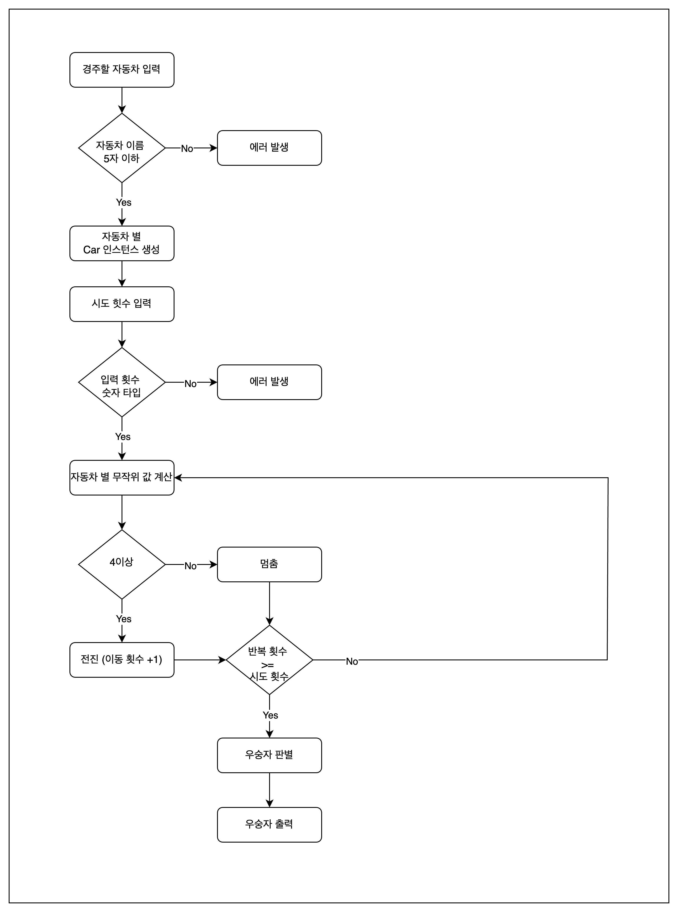

# [Week 2] 문자열 덧셈 계산기

## 📍 요구사항

자동차 경주 게임 구현

- 시도 횟수 동안 n대의 자동차는 전진 또는 멈춤
- 각 자동차에 이름 부여, 쉼표를 기준으로 구분하며 5자 이하로 입력
- 시도할 횟수 입력
- 0에서 9사이의 무작위 값을 구한 후, 4 이상인 경우 전진
- 자동차 이름을 포함하여 전진하는 자동차 출력
- 자동차 경주 게임 완료 후 우승자 출력, 여러 명일 경우 쉼표로 구분
- 잘못된 값 입력 시, 에러 발생 후 종료

## ✅ 구현해야 할 기능

- [x] 경주할 자동차 이름 입력
- [x] 자동차 이름 유효성 검증
- [x] 각 자동차 별 Car 인스턴스 생성
  - [x] 속성으로 이름과 이동 횟수 설정
- [x] 시도할 횟수 입력
- [x] 횟수가 숫자 타입인지 유효성 검증
- [x] 자동차 별 무작위 값 계산
- [x] 전진 및 멈춤 판단
- [x] 차수별 실행 결과 출력
- [x] 우승자 판별
- [x] 우승자 출력
- [x] 에러 처리

## 🖊️ 흐름도 설계



## 👩🏻‍💻 구현 내용 정리

### Car 클래스

- 속성으로 이름과 이동 횟수 Private 설정

```js
class Car {
  #name;
  #move;

  constructor(name, move) {
    this.#name = name;
    this.#move = move;
  }

  // ...
}
```

- 전진 메서드는 전진 판단 후 setMove 메서드를 통해 전진

```js
  moveCar() {
    const number = MissionUtils.Random.pickNumberInRange(0, 9);
    if (number >= 4) this.setMove(1);
  }
```

### 우승자 판단

- reduce 메서드 활용
- 우승자가 한 명인 경우 현재 값을 가진 하나의 배열
- 우승자가 여러 명인 경우 배열에 푸시하는 형식으로 진행

```js
const findMaxMoveCars = (cars) => {
  return cars.reduce((acc, currentCar) => {
    if (acc.length === 0 || currentCar.getMove() > acc[0].getMove()) {
      return [currentCar];
    }
    if (currentCar.getMove() === acc[0].getMove()) {
      acc.push(currentCar);
    }
    return acc;
  }, []);
};

export default findMaxMoveCars;
```

## 📖 참고 사항
